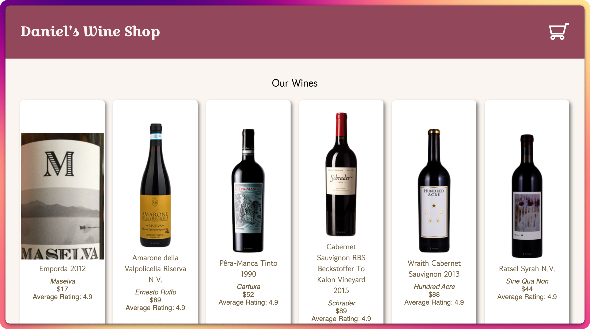
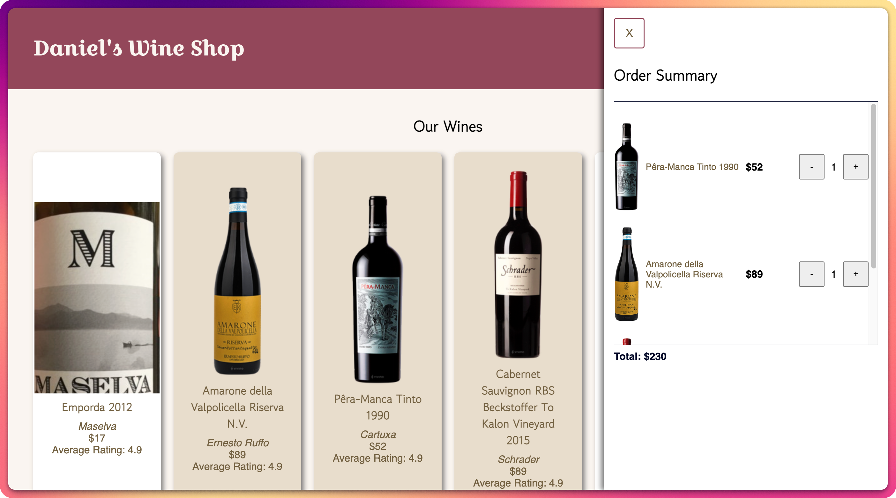
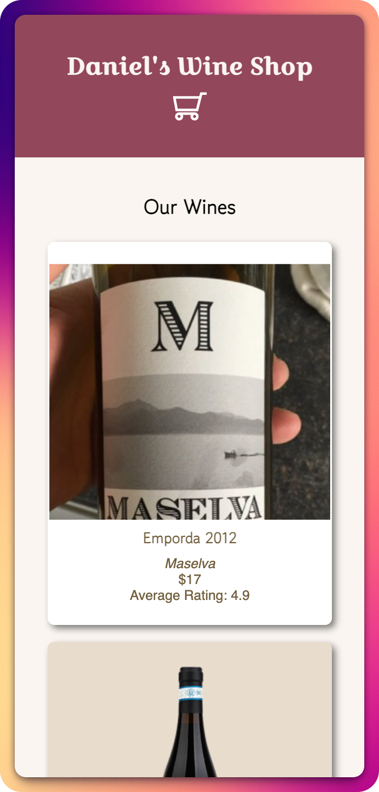
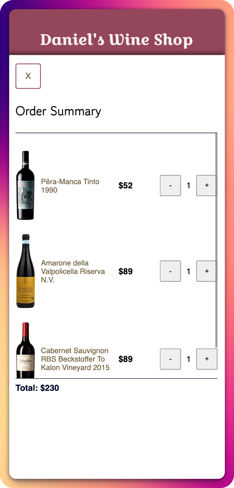

# E-Commerce Starter

A single-page commerce site built with React, [ParcelJS](https://parceljs.org/), and aiming to follow accessibility best practices using semantic HTML (proper heading structure and landmark regions)

[Live Demo](https://danielswineshop.netlify.app)

---

## 📸 Screenshots

  
  
  
  

## 🧰 Built With

- React ([ParcelJS](https://parceljs.org/))
- Wines API from [sampleapis.com](sampleapis.com)
- Semantic HTML
- CSS Flexbox
